# AI Architecture Patterns
## The Complete Guide to Designing Modern AI Systems

Artificial Intelligence architecture is evolving rapidly.

A few years ago, an AI application could often be described as:

**Application → Model → Response**

Today, production AI systems can contain:

- Foundation models
- Small language models
- RAG
- Vector and hybrid search
- Knowledge graphs
- Agents
- Tool calling
- Memory
- Planning
- Model routing
- Prompt chaining
- Parallel workflows
- Evaluator-optimizer loops
- Multi-agent orchestration
- Human-in-the-loop
- Guardrails
- AI gateways
- Evaluation pipelines
- Observability
- Event-driven processing
- Traditional deterministic services

This creates a new challenge for architects:

> **How do we choose the right AI architecture pattern without making the system unnecessarily complex?**

The answer is not to start with a framework or an LLM.

Start with the **business problem, autonomy required, knowledge required, workflow complexity, risk, and operational requirements**.

This article provides a practical catalog of the major AI architecture patterns and explains how they fit together.

---

# 1. First: What Is an AI Architecture Pattern?

An **AI architecture pattern** is a reusable architectural approach for solving a recurring problem in an AI-enabled system.

It describes things such as:

- How intelligence is invoked
- How knowledge is provided
- How tasks are decomposed
- How decisions are made
- How AI components interact
- How workflows are controlled
- How results are validated
- How humans participate
- How the system scales and remains reliable

Think of patterns as architectural building blocks.

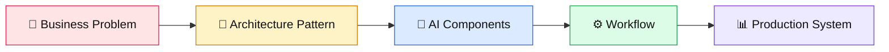

The key principle is:

> **Patterns are composable. They are not mutually exclusive.**

A production system can use:

**RAG + Routing + Agent + Tools + Memory + Guardrails + Human Approval + Evaluation + Observability**

---

# 2. The Complete AI Architecture Pattern Landscape

A useful architecture taxonomy is to divide AI patterns into seven major groups.

```mermaid
flowchart TB

    AI["🧠 AI ARCHITECTURE PATTERNS"]

    AI --> P["1️⃣ MODEL & INFERENCE"]
    AI --> K["2️⃣ KNOWLEDGE & GROUNDING"]
    AI --> W["3️⃣ WORKFLOW & REASONING"]
    AI --> A["4️⃣ AGENT & ORCHESTRATION"]
    AI --> I["5️⃣ DATA & INTEGRATION"]
    AI --> R["6️⃣ RELIABILITY & CONTROL"]
    AI --> O["7️⃣ OPERATIONS & GOVERNANCE"]

    P --> P1["Direct Model Call"]
    P --> P2["Model Routing"]
    P --> P3["Model Fallback"]
    P --> P4["Model Cascade"]

    K --> K1["RAG"]
    K --> K2["Hybrid Search"]
    K --> K3["GraphRAG"]
    K --> K4["Agentic RAG"]
    K --> K5["Memory"]
    K --> K6["Context Engineering"]

    W --> W1["Prompt Chaining"]
    W --> W2["Routing"]
    W --> W3["Parallelization"]
    W --> W4["Conditional Branching"]
    W --> W5["Evaluator-Optimizer"]
    W --> W6["Reflection"]
    W --> W7["Planning"]

    A --> A1["Single Agent"]
    A --> A2["Tool-Using Agent"]
    A --> A3["Orchestrator-Workers"]
    A --> A4["Multi-Agent"]
    A --> A5["Sequential"]
    A --> A6["Concurrent"]
    A --> A7["Handoff"]
    A --> A8["Group Chat"]
    A --> A9["Magentic"]

    I --> I1["API / Tool Calling"]
    I --> I2["MCP Integration"]
    I --> I3["Event-Driven AI"]
    I --> I4["Human-in-the-Loop"]
    I --> I5["Traditional Software + AI"]

    R --> R1["Guardrails"]
    R --> R2["Authorization-Aware RAG"]
    R --> R3["Caching"]
    R --> R4["Retry / Recovery"]
    R --> R5["Stateful Execution"]

    O --> O1["Evaluation"]
    O --> O2["Observability"]
    O --> O3["AI Gateway"]
    O --> O4["Security"]
    O --> O5["Governance"]
    O --> O6["Cost Management"]

    classDef root fill:#7C3AED,color:#fff,stroke:#5B21B6;
    classDef model fill:#DBEAFE,stroke:#2563EB,color:#111;
    classDef knowledge fill:#DCFCE7,stroke:#16A34A,color:#111;
    classDef workflow fill:#FEF3C7,stroke:#D97706,color:#111;
    classDef agent fill:#FCE7F3,stroke:#DB2777,color:#111;
    classDef integration fill:#E0F2FE,stroke:#0284C7,color:#111;
    classDef reliability fill:#FFE4E6,stroke:#E11D48,color:#111;
    classDef operations fill:#EDE9FE,stroke:#7C3AED,color:#111;

    class AI root;
    class P,P1,P2,P3,P4 model;
    class K,K1,K2,K3,K4,K5,K6 knowledge;
    class W,W1,W2,W3,W4,W5,W6,W7 workflow;
    class A,A1,A2,A3,A4,A5,A6,A7,A8,A9 agent;
    class I,I1,I2,I3,I4,I5 integration;
    class R,R1,R2,R3,R4,R5 reliability;
    class O,O1,O2,O3,O4,O5,O6 operations;
```

This is the mental model I recommend using as an AI Architect.

---

# 3. Pattern #1 — Direct Model Call

The simplest AI architecture is a direct call to a model.

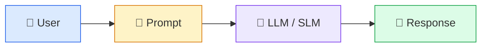

Use this for:

- Summarization
- Translation
- Classification
- Rewriting
- Simple generation
- Extraction
- Basic Q&A

### Architectural principle

> **If a single model call solves the problem, don't build an agent.**

Current Microsoft guidance explicitly recommends starting with the least complex architecture: a direct model call when prompt engineering is sufficient.

---

# 4. Pattern #2 — Deterministic AI Workflow

Here the application controls the workflow.

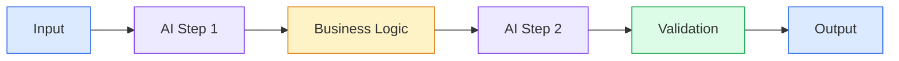

The LLM does **not** decide the workflow.

The application does.

This is ideal for:

- Compliance workflows
- Document processing
- Known business processes
- Repeatable pipelines
- Auditable systems

Deterministic workflows provide predictability and are generally easier to test and audit than autonomous agent loops.

---

# 5. Pattern #3 — Prompt Chaining

Prompt chaining decomposes a complex task into sequential AI steps.

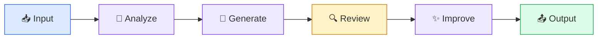

Example:

**Research → Extract → Analyze → Summarize**

Prompt chaining is particularly useful when intermediate outputs become inputs to later stages. AWS describes this pattern as sequential decomposition of complex tasks into discrete LLM invocations.

---

# 6. Pattern #4 — Routing

Routing determines which model, workflow, tool, or agent should process a request.

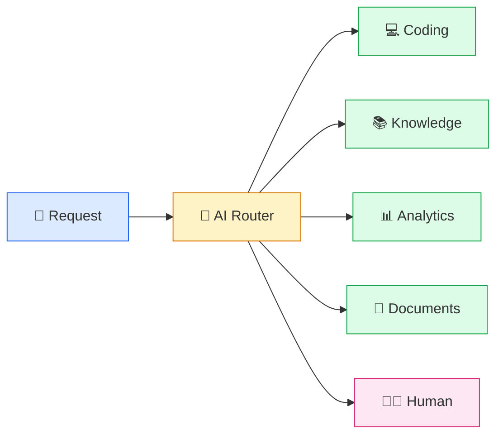

Routing can be based on:

- Intent
- Complexity
- User type
- Domain
- Data sensitivity
- Model capability
- Cost
- Lat​ency

AWS identifies routing as a core workflow pattern for dispatching requests to specialized agents, workflows, or tools.

---

# 7. Pattern #5 — Model Routing

Routing can happen specifically between models.

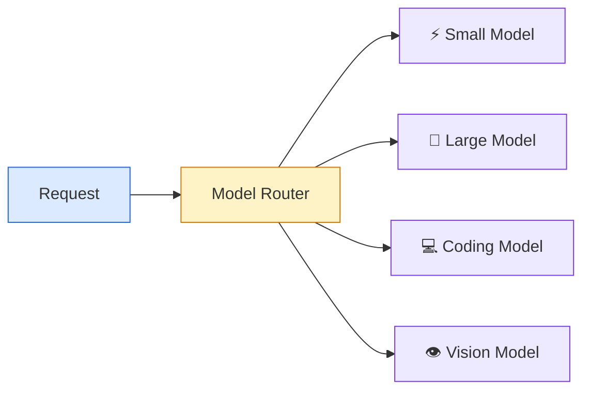

The objective is:

> **Use the cheapest and fastest model capable of solving the task.**

This becomes increasingly important in enterprise AI platforms.

---

# 8. Pattern #6 — Model Cascade

Model cascade is related to routing but uses progressive escalation.

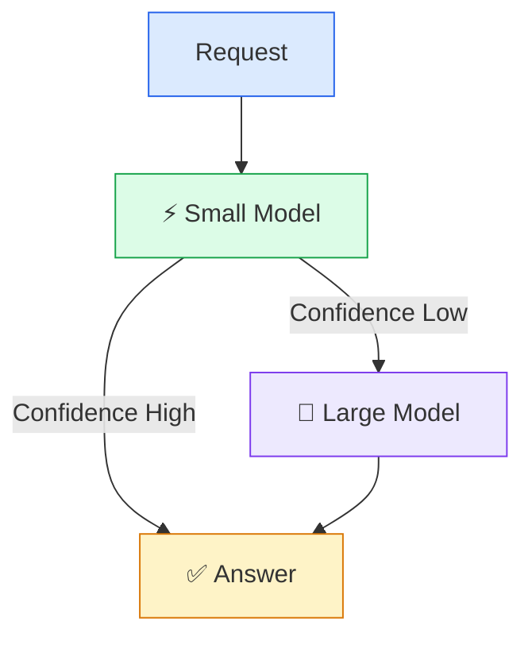

This can reduce:

- Cost
- Latency
- Large-model utilization

---

# 9. Pattern #7 — Parallelization

Independent tasks can execute simultaneously.

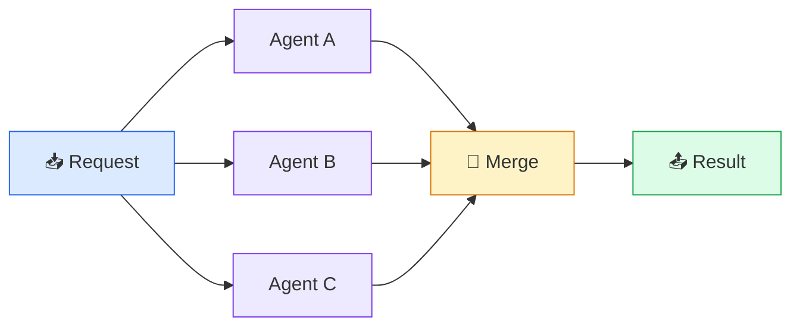

Also called:

- Parallelization
- Fan-out / fan-in
- Scatter-gather
- Map-reduce

Use it when tasks are independent.

Microsoft and AWS both document parallel/concurrent processing as a major AI workflow pattern.

---

# 10. Pattern #8 — Conditional Branching

Not every request follows the same path.

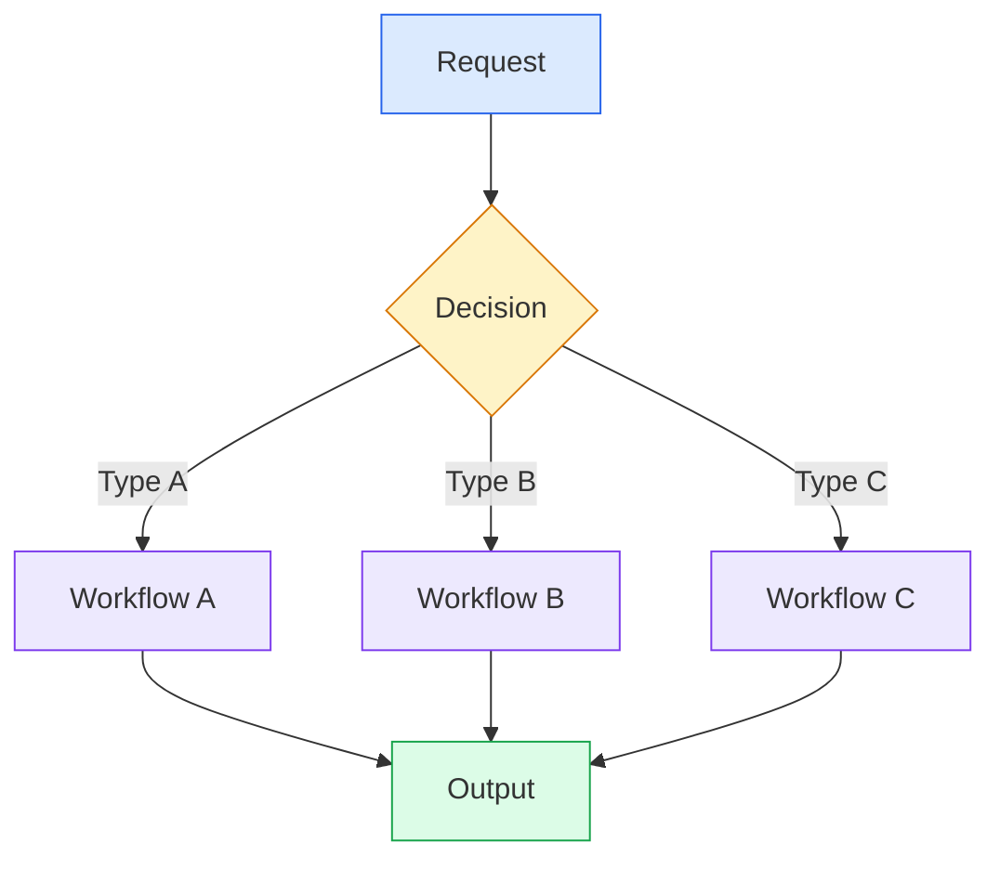

This is useful for:

- Risk classification
- Support triage
- Document classification
- AI-assisted business workflows

---

# 11. Pattern #9 — Evaluator-Optimizer

One model generates an answer.

Another process evaluates it.

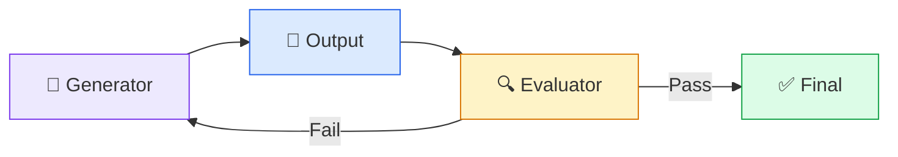

Also known as:

- Generator-verifier
- Maker-checker
- Critic loop
- Reflect-refine
- Evaluator-optimizer

Microsoft explicitly identifies maker-checker loops as evaluator-optimizer / generator-verifier / reflection loops.

---

# 12. Pattern #10 — Reflection / Self-Correction

The AI evaluates its own output and improves it.

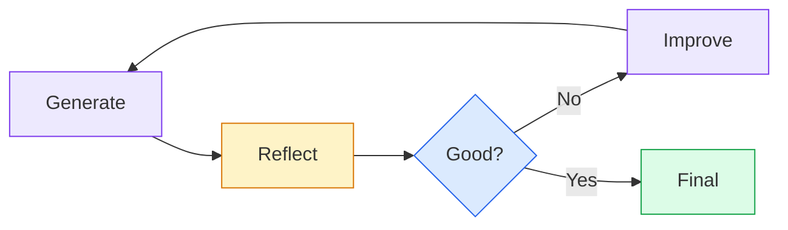

Useful for:

- Code review
- Architecture review
- Research
- Content generation
- RAG quality improvement

Always impose an iteration limit.

---

# 13. Pattern #11 — Planning

Complex tasks can be decomposed into a plan before execution.

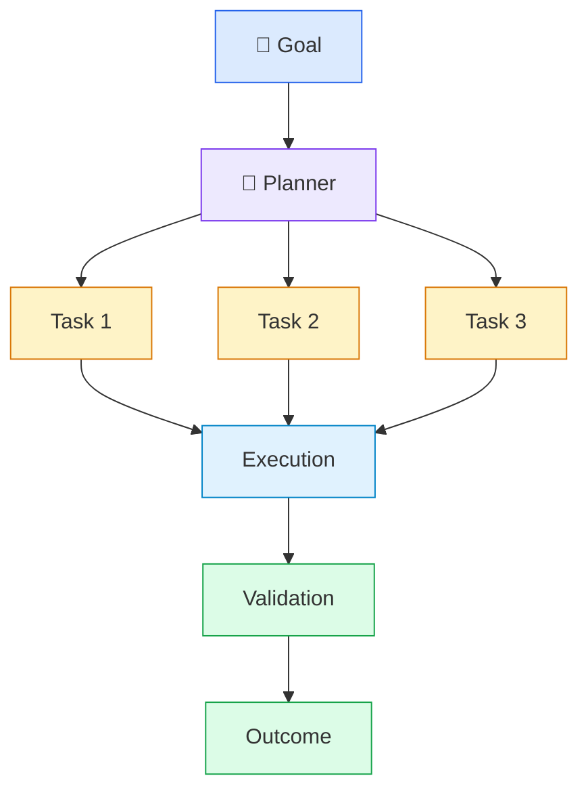

Planning is useful when the task is open-ended or has multiple dependencies.

---

# 14. Pattern #12 — Orchestrator-Workers

A manager creates tasks dynamically and delegates them to specialized workers.

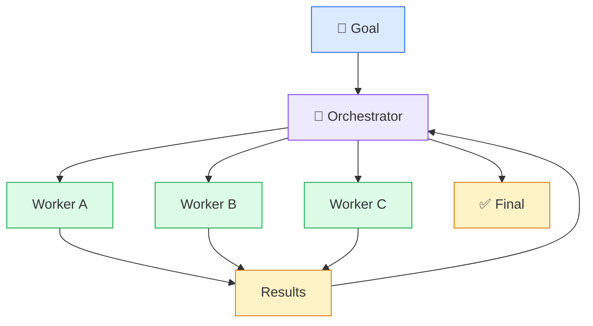

Unlike a fixed pipeline, the orchestrator dynamically decides:

- Which tasks are needed
- Which worker performs them
- What order they execute
- Whether additional work is necessary

---

# 15. Pattern #13 — Single Agent

An agent can reason, select tools, and execute multiple steps.

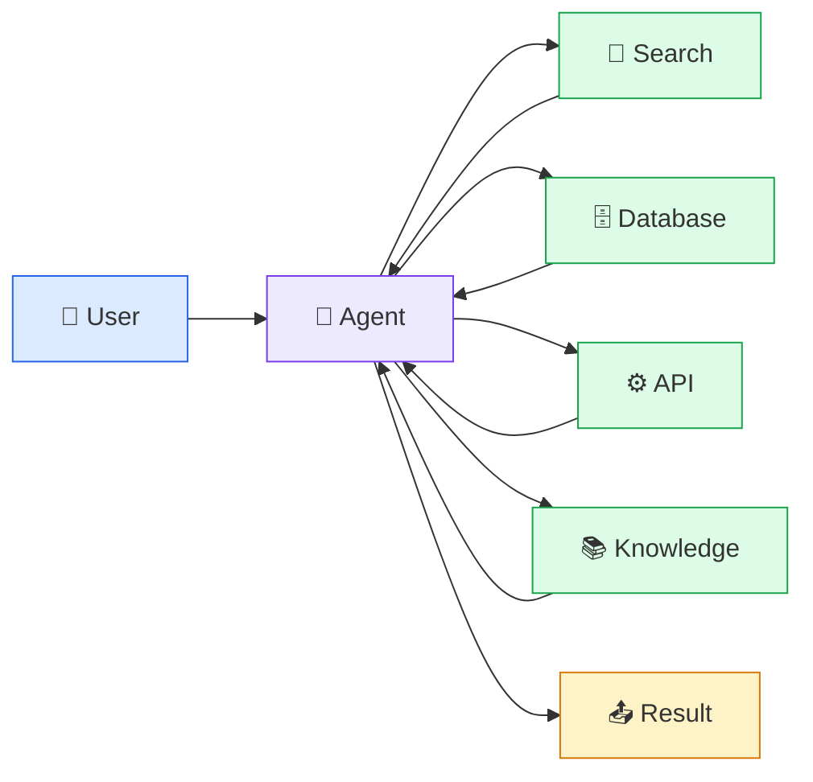

A single agent is often the best starting point for agentic applications.

Microsoft's current guidance explicitly notes that a single agent with multiple tools is often preferable to immediately introducing multi-agent complexity.

---

# 16. Pattern #14 — Tool-Using Agent

The agent dynamically selects tools.

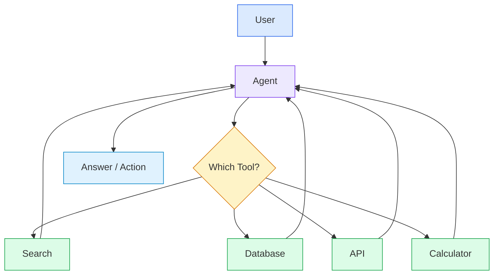

This is one of the fundamental building blocks of modern agents.

---

# 17. Pattern #15 — RAG

RAG separates model intelligence from enterprise knowledge.

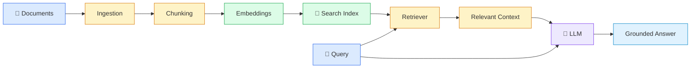

RAG is an architecture pattern for grounding model responses in external or proprietary information. Microsoft describes it as an industry-standard pattern for applications that need specific or proprietary data.

---

# 18. RAG Is Not One Pattern

RAG itself has evolved into several architecture patterns.

## Naive / Standard RAG

```text
Query → Retrieve → Context → LLM → Answer
```

## Hybrid RAG

```text
Query
 ├── Keyword Search
 └── Vector Search
          ↓
       Reranker
          ↓
         LLM
```

## GraphRAG

```text
Query
  ↓
Entity / Relationship Retrieval
  ↓
Knowledge Graph
  ↓
LLM
```

## Agentic RAG

```text
Query
  ↓
Agent
  ├── Search
  ├── Re-search
  ├── Database
  ├── API
  └── Knowledge Graph
          ↓
        LLM
```

## Self-Reflective RAG

```text
Retrieve
   ↓
Generate
   ↓
Evaluate
   ↓
Enough?
 ┌─┴─┐
No  Yes
│    │
└─►Retrieve
     again
```

Microsoft's current RAG guidance explicitly discusses standard RAG, agentic RAG, GraphRAG-style retrieval, and self-reflective approaches.

---

# 19. Pattern #16 — Agentic RAG

Agentic RAG combines retrieval with agent reasoning.

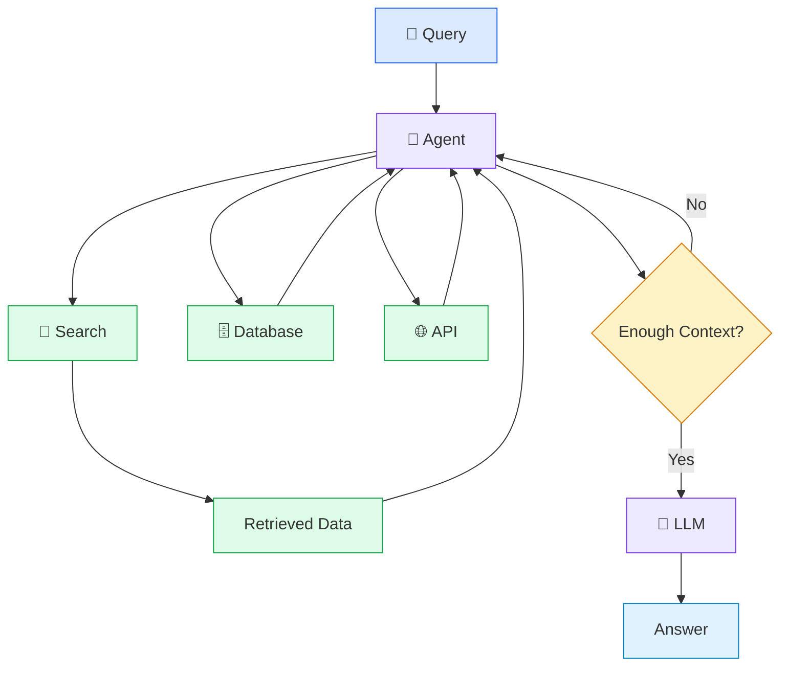

Agentic RAG is appropriate when retrieval itself requires dynamic reasoning, multiple searches, query decomposition, or combining retrieval with actions.

---

# 20. Pattern #17 — Memory

Memory allows AI applications to maintain state beyond a single model call.

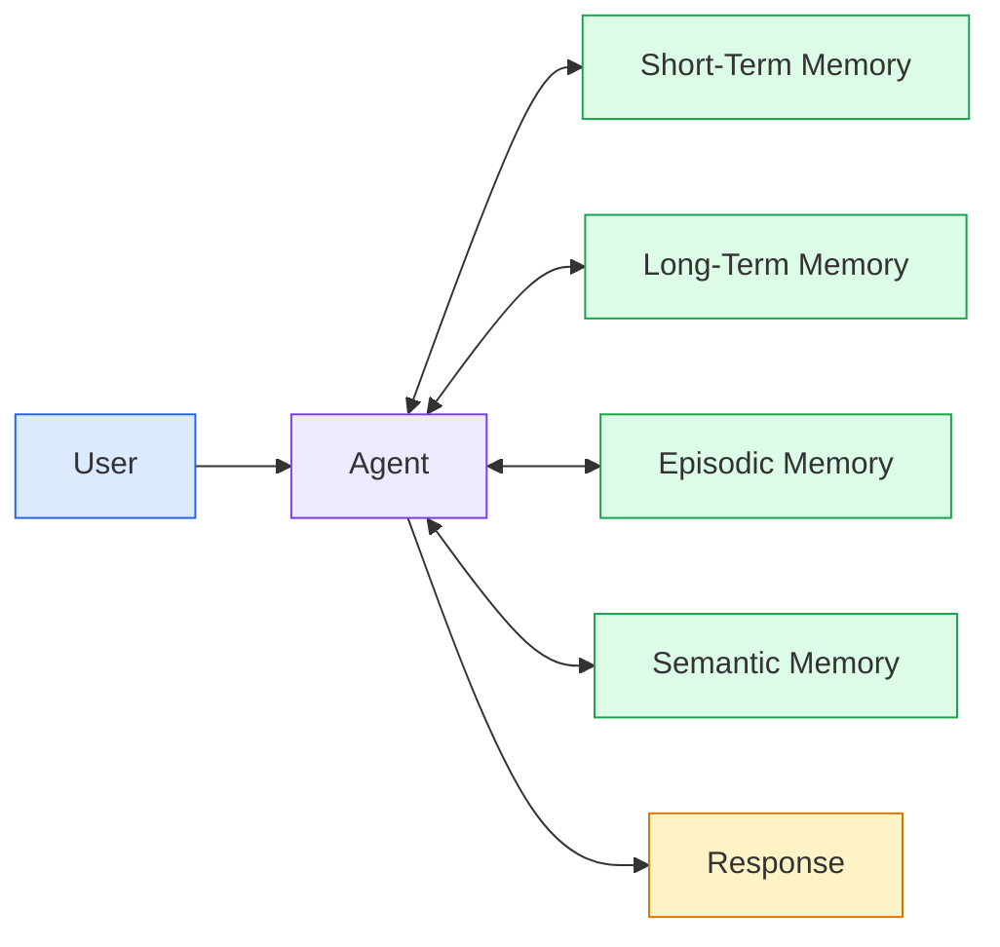

Memory can include:

- Conversation state
- User preferences
- Previous tasks
- Facts
- Decisions
- Long-term knowledge
- Agent state

AWS describes agent memory using external stores, RAG, in-context information, and persistent agent state.

---

# 21. Pattern #18 — Context Engineering

Context engineering determines **what information reaches the model**.

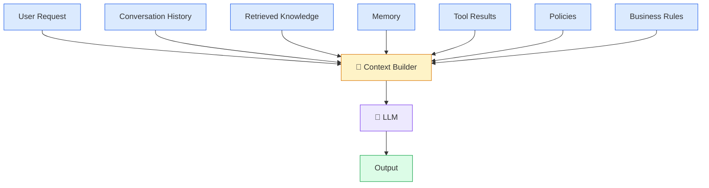

This is broader than prompt engineering.

The architect controls:

- What context is retrieved
- How much context is included
- Which sources are trusted
- How context is prioritized
- What gets removed
- What gets summarized

---

# 22. Pattern #19 — Knowledge Routing

Enterprise knowledge is often distributed.

```mermaid
flowchart LR
    Q["Query"] --> R["Knowledge Router"]

    R --> C["Confluence"]
    R --> G["Git"]
    R --> S["SharePoint"]
    R --> DB["Databases"]
    R --> W["Web"]

    C --> M["Merge"]
    G --> M
    S --> M
    DB --> M
    W --> M

    M --> L["LLM"]

    classDef q fill:#DBEAFE,stroke:#2563EB;
    classDef router fill:#FEF3C7,stroke:#D97706;
    classDef source fill:#DCFCE7,stroke:#16A34A;
    classDef model fill:#EDE9FE,stroke:#7C3AED;

    class Q q;
    class R router;
    class C,G,S,DB,W source;
    class M,L model;
```

This pattern is valuable in enterprise environments where information is fragmented across many systems.

---

# 23. Pattern #20 — Multi-Agent Architecture

Multiple specialized agents collaborate.

```mermaid
flowchart TD
    U["👤 User"] --> O["🎯 Orchestrator"]

    O --> A["🔐 Security Agent"]
    O --> B["☁️ Cloud Agent"]
    O --> C["💰 Cost Agent"]
    O --> D["⚙️ DevOps Agent"]

    A --> R["Aggregation"]
    B --> R
    C --> R
    D --> R

    R --> F["Final Recommendation"]

    classDef user fill:#DBEAFE,stroke:#2563EB;
    classDef orch fill:#EDE9FE,stroke:#7C3AED;
    classDef agents fill:#DCFCE7,stroke:#16A34A;
    classDef result fill:#FEF3C7,stroke:#D97706;

    class U user;
    class O orch;
    class A,B,C,D agents;
    class R,F result;
```

Multi-agent architecture is useful when:

- Domains are genuinely different
- Agents require different tools
- Security boundaries differ
- Tasks can run independently
- Specialization improves quality

But it adds:

- Latency
- Cost
- Coordination complexity
- Failure modes

Microsoft explicitly recommends adding multi-agent complexity only when a single agent cannot reliably handle the problem.

---

# 24. Multi-Agent Orchestration Patterns

This deserves its own architecture category.

## 24.1 Sequential

```mermaid
flowchart LR
    I["Input"] --> A["Agent A"] --> B["Agent B"] --> C["Agent C"] --> O["Output"]

    classDef io fill:#DBEAFE,stroke:#2563EB;
    classDef agent fill:#EDE9FE,stroke:#7C3AED;
    classDef output fill:#DCFCE7,stroke:#16A34A;

    class I io;
    class A,B,C agent;
    class O output;
```

Use when the sequence is known.

---

## 24.2 Concurrent

```mermaid
flowchart TD
    I["Input"] --> A["Agent A"]
    I --> B["Agent B"]
    I --> C["Agent C"]

    A --> M["Aggregator"]
    B --> M
    C --> M

    classDef input fill:#DBEAFE,stroke:#2563EB;
    classDef agent fill:#EDE9FE,stroke:#7C3AED;
    classDef merge fill:#FEF3C7,stroke:#D97706;

    class I input;
    class A,B,C agent;
    class M merge;
```

Use for independent analysis.

---

## 24.3 Handoff

```mermaid
flowchart LR
    A["Agent A"] -->|Handoff| B["Agent B"]
    B -->|Handoff| C["Agent C"]

    classDef agent fill:#EDE9FE,stroke:#7C3AED;

    class A,B,C agent;
```

The active agent transfers responsibility.

Useful for:

- Escalation
- Specialist routing
- Customer support
- Dynamic workflows

---

## 24.4 Group Chat

```mermaid
flowchart TD
    M["Chat Manager"]

    M --> A["Agent A"]
    M --> B["Agent B"]
    M --> C["Agent C"]

    A <--> B
    B <--> C
    C <--> A

    classDef manager fill:#FEF3C7,stroke:#D97706;
    classDef agent fill:#EDE9FE,stroke:#7C3AED;

    class M manager;
    class A,B,C agent;
```

Useful for:

- Brainstorming
- Consensus
- Collaborative analysis
- Debate

---

## 24.5 Magentic / Dynamic Orchestration

```mermaid
flowchart TD
    G["🎯 Goal"] --> M["Dynamic Manager"]

    M --> P["Task Plan"]
    P --> A["Agent A"]
    P --> B["Agent B"]
    P --> C["Agent C"]

    A --> F["Feedback"]
    B --> F
    C --> F

    F --> M
    M --> P

    classDef goal fill:#DBEAFE,stroke:#2563EB;
    classDef manager fill:#EDE9FE,stroke:#7C3AED;
    classDef task fill:#FEF3C7,stroke:#D97706;
    classDef agent fill:#DCFCE7,stroke:#16A34A;

    class G goal;
    class M manager;
    class P,F task;
    class A,B,C agent;
```

The manager dynamically creates and adapts the task plan.

Microsoft currently describes sequential, concurrent, group chat, handoff, and magentic as key multi-agent orchestration patterns.

---

# 25. Pattern #21 — Tool Calling

Tool calling connects AI reasoning with deterministic capabilities.

```mermaid
flowchart LR
    A["🤖 AI Agent"] --> T["Tool Interface"]

    T --> API["REST API"]
    T --> DB["Database"]
    T --> K["Kubernetes"]
    T --> G["GitHub"]
    T --> S["Search"]

    API --> T
    DB --> T
    K --> T
    G --> T
    S --> T

    T --> A

    classDef agent fill:#EDE9FE,stroke:#7C3AED;
    classDef interface fill:#FEF3C7,stroke:#D97706;
    classDef tool fill:#DCFCE7,stroke:#16A34A;

    class A agent;
    class T interface;
    class API,DB,K,G,S tool;
```

This is an **architecture pattern**.

---

# 26. MCP — Important, But Not an AI Architecture Pattern

This is where I would make a clear distinction in the blog.

**MCP is not itself an AI architecture pattern.**

MCP — Model Context Protocol — is a **protocol/integration mechanism** that standardizes how AI applications can interact with tools, resources, and other context.

Architecturally:

```mermaid
flowchart LR
    A["🤖 AI Application / Agent"] --> M["MCP Client"]

    M --> S1["MCP Server"]
    M --> S2["MCP Server"]
    M --> S3["MCP Server"]

    S1 --> T1["Tools"]
    S2 --> T2["Resources"]
    S3 --> T3["Enterprise APIs"]

    classDef app fill:#EDE9FE,stroke:#7C3AED;
    classDef mcp fill:#FEF3C7,stroke:#D97706;
    classDef server fill:#DBEAFE,stroke:#2563EB;
    classDef resource fill:#DCFCE7,stroke:#16A34A;

    class A app;
    class M mcp;
    class S1,S2,S3 server;
    class T1,T2,T3 resource;
```

Therefore:

> **Tool-use is an AI architecture pattern. MCP is one protocol that can implement the integration layer used by that pattern.**

This distinction is important for architects.

AWS likewise describes MCP as a mechanism for providing agents access to external capabilities, data, and APIs.

Official reference:

[Model Context Protocol](https://modelcontextprotocol.io/)

---

# 27. Pattern #22 — Event-Driven AI

AI does not always need to start with a user request.

```mermaid
flowchart LR
    E["⚡ Event"] --> B["Event Bus"]

    B --> A["AI Processor"]
    B --> W["Workflow"]
    B --> R["Rules"]

    A --> O["Action"]
    W --> O
    R --> O

    classDef event fill:#FEF3C7,stroke:#D97706;
    classDef bus fill:#DBEAFE,stroke:#2563EB;
    classDef process fill:#EDE9FE,stroke:#7C3AED;
    classDef output fill:#DCFCE7,stroke:#16A34A;

    class E event;
    class B bus;
    class A,W,R process;
    class O output;
```

Examples:

- New document → AI extraction
- New GitHub PR → Code review
- New incident → Root-cause analysis
- New customer → Classification
- New message → Summarization

---

# 28. Pattern #23 — Human-in-the-Loop

AI autonomy should correspond to business risk.

```mermaid
flowchart TD
    A["AI Decision"] --> C{"Confidence / Risk"}

    C -->|Low Risk| X["Automatic Action"]
    C -->|High Risk| H["👤 Human Review"]

    H --> X

    classDef ai fill:#EDE9FE,stroke:#7C3AED;
    classDef decision fill:#FEF3C7,stroke:#D97706;
    classDef auto fill:#DCFCE7,stroke:#16A34A;
    classDef human fill:#FCE7F3,stroke:#DB2777;

    class A ai;
    class C decision;
    class X auto;
    class H human;
```

Use human approval for:

- Financial decisions
- Production changes
- Security actions
- Legal decisions
- Compliance
- High-impact customer actions

---

# 29. Pattern #24 — AI + Traditional Software

One of the most important architecture patterns is knowing where **not** to use AI.

```mermaid
flowchart TB
    A["Application"]

    A --> AI["🤖 AI"]
    A --> D["⚙️ Deterministic Software"]
    A --> R["📐 Rules Engine"]

    AI --> O["Business Outcome"]
    D --> O
    R --> O

    classDef app fill:#DBEAFE,stroke:#2563EB;
    classDef ai fill:#EDE9FE,stroke:#7C3AED;
    classDef deterministic fill:#DCFCE7,stroke:#16A34A;
    classDef rules fill:#FEF3C7,stroke:#D97706;

    class A app;
    class AI ai;
    class D deterministic;
    class R rules;
    class O app;
```

Use traditional software for:

- Authentication
- Authorization
- Financial calculations
- Transactions
- Deterministic validation
- Safety constraints
- Exact business rules

Use AI for:

- Natural-language understanding
- Classification
- Summarization
- Reasoning
- Generation
- Ambiguous input interpretation

---

# 30. Pattern #25 — Guardrails

Guardrails constrain AI behavior.

```mermaid
flowchart LR
    I["Input"] --> G1["Input Guardrail"]
    G1 --> A["AI / Agent"]
    A --> G2["Tool Authorization"]
    G2 --> G3["Output Guardrail"]
    G3 --> O["Response"]

    classDef input fill:#DBEAFE,stroke:#2563EB;
    classDef guard fill:#FEF3C7,stroke:#D97706;
    classDef ai fill:#EDE9FE,stroke:#7C3AED;
    classDef output fill:#DCFCE7,stroke:#16A34A;

    class I input;
    class G1,G2,G3 guard;
    class A ai;
    class O output;
```

Guardrails can protect against:

- Prompt injection
- Data leakage
- Unsafe actions
- Policy violations
- Tool misuse
- Sensitive information exposure

Guardrails are a **cross-cutting architecture concern**, not merely prompt instructions.

---

# 31. Pattern #26 — Authorization-Aware RAG

Enterprise RAG must respect permissions.

```mermaid
flowchart LR
    U["👤 User"] --> I["Identity"]
    I --> A["Authorization"]
    A --> R["Retriever"]

    R --> D1["Allowed Data"]
    R -.-> D2["Restricted Data"]

    D1 --> L["LLM"]
    L --> O["Answer"]

    classDef user fill:#DBEAFE,stroke:#2563EB;
    classDef security fill:#FFE4E6,stroke:#E11D48;
    classDef retrieval fill:#FEF3C7,stroke:#D97706;
    classDef data fill:#DCFCE7,stroke:#16A34A;
    classDef model fill:#EDE9FE,stroke:#7C3AED;

    class U user;
    class I,A security;
    class R retrieval;
    class D1 data;
    class D2 security;
    class L model;
    class O data;
```

The key principle:

> **Retrieval permissions must never be weaker than the underlying data permissions.**

---

# 32. Pattern #27 — Caching

AI systems can cache expensive operations.

```mermaid
flowchart LR
    Q["Request"] --> C{"Cache Hit?"}

    C -->|Yes| R["Cached Result"]
    C -->|No| L["LLM / Retrieval"]

    L --> S["Store Cache"]
    S --> R

    classDef query fill:#DBEAFE,stroke:#2563EB;
    classDef cache fill:#FEF3C7,stroke:#D97706;
    classDef model fill:#EDE9FE,stroke:#7C3AED;
    classDef result fill:#DCFCE7,stroke:#16A34A;

    class Q query;
    class C,S cache;
    class L model;
    class R result;
```

Possible caches:

- Exact response
- Semantic response
- Retrieval results
- Embeddings
- Tool results

---

# 33. Pattern #28 — Retry and Recovery

AI systems fail.

Tools fail.

Models timeout.

APIs become unavailable.

Architecture should expect failure.

```mermaid
flowchart TD
    A["AI Step"] --> C{"Success?"}

    C -->|Yes| O["Continue"]
    C -->|No| R["Retry"]

    R --> C
    R --> F["Fallback"]
    F --> H["Human / Graceful Degradation"]

    classDef ai fill:#EDE9FE,stroke:#7C3AED;
    classDef decision fill:#FEF3C7,stroke:#D97706;
    classDef success fill:#DCFCE7,stroke:#16A34A;
    classDef recovery fill:#FFE4E6,stroke:#E11D48;

    class A ai;
    class C decision;
    class O success;
    class R,F,H recovery;
```

Production AI needs:

- Timeouts
- Retry limits
- Backoff
- Circuit breakers
- Fallback models
- Dead-letter handling
- Graceful degradation

---

# 34. Pattern #29 — Stateful AI Workflow

Long-running AI processes need persistent state.

```mermaid
flowchart LR
    A["Workflow"] <--> S["State Store"]
    A --> T1["Task 1"]
    T1 --> T2["Task 2"]
    T2 --> T3["Task 3"]

    T3 --> C["Checkpoint"]

    C --> S

    classDef workflow fill:#EDE9FE,stroke:#7C3AED;
    classDef state fill:#FEF3C7,stroke:#D97706;
    classDef task fill:#DCFCE7,stroke:#16A34A;

    class A workflow;
    class S,C state;
    class T1,T2,T3 task;
```

Useful for:

- Long-running agents
- Human approval
- Multi-step workflows
- Interrupted execution
- Durable processes

---

# 35. Pattern #30 — Evaluation-Driven AI

AI architecture must include evaluation from the beginning.

```mermaid
flowchart TB
    A["AI Application"] --> O["Outputs"]
    O --> E["Evaluation"]

    E --> Q["Quality"]
    E --> G["Groundedness"]
    E --> S["Safety"]
    E --> C["Cost"]
    E --> L["Latency"]

    Q --> I["Improve"]
    G --> I
    S --> I
    C --> I
    L --> I

    I --> A

    classDef app fill:#EDE9FE,stroke:#7C3AED;
    classDef eval fill:#FEF3C7,stroke:#D97706;
    classDef metric fill:#DBEAFE,stroke:#2563EB;
    classDef improve fill:#DCFCE7,stroke:#16A34A;

    class A app;
    class O,E eval;
    class Q,G,S,C,L metric;
    class I improve;
```

Evaluate different layers separately.

### RAG

- Retrieval relevance
- Recall
- Precision
- Groundedness

### Generation

- Accuracy
- Completeness
- Faithfulness
- Relevance

### Agents

- Tool selection
- Task completion
- Number of steps
- Failure rate

### Platform

- Cost
- Latency
- Availability
- Throughput

Microsoft's current RAG architecture guidance treats evaluation as a first-class part of RAG design rather than an afterthought.

---

# 36. Pattern #31 — AI Observability

AI requires deeper observability than traditional applications.

```mermaid
flowchart LR
    U["User"] --> A["Agent"]

    A --> R["RAG"]
    A --> T["Tools"]
    A --> M["Model"]

    A --> O["🔭 AI Observability"]

    R --> O
    T --> O
    M --> O

    O --> C["Cost"]
    O --> L["Latency"]
    O --> Q["Quality"]
    O --> E["Errors"]
    O --> X["Traces"]

    classDef app fill:#EDE9FE,stroke:#7C3AED;
    classDef component fill:#DBEAFE,stroke:#2563EB;
    classDef obs fill:#FEF3C7,stroke:#D97706;
    classDef metric fill:#DCFCE7,stroke:#16A34A;

    class U,A app;
    class R,T,M component;
    class O obs;
    class C,L,Q,E,X metric;
```

You should be able to trace:

**User → Router → Agent → Retrieval → Tool → Model → Response**

---

# 37. Pattern #32 — AI Gateway

At enterprise scale, applications should not all directly integrate with every model provider.

```mermaid
flowchart TB
    A["Application A"] --> G["🛡️ AI Gateway"]
    B["Application B"] --> G
    C["Application C"] --> G

    G --> O["OpenAI"]
    G --> Gm["Gemini"]
    G --> S["SLM"]
    G --> OSS["Open Source"]

    G --> P["Policy"]
    G --> M["Monitoring"]
    G --> Cst["Cost Control"]

    classDef apps fill:#DBEAFE,stroke:#2563EB;
    classDef gateway fill:#EDE9FE,stroke:#7C3AED;
    classDef models fill:#DCFCE7,stroke:#16A34A;
    classDef control fill:#FEF3C7,stroke:#D97706;

    class A,B,C apps;
    class G gateway;
    class O,Gm,S,OSS models;
    class P,M,Cst control;
```

The gateway can provide:

- Model abstraction
- Authentication
- Rate limiting
- Routing
- Cost management
- Logging
- Policy enforcement
- Failover

---

# 38. Pattern #33 — Event-Driven Multi-Agent Architecture

Large AI platforms can combine agents and asynchronous messaging.

```mermaid
flowchart LR
    E["Event"] --> B["Event Bus"]

    B --> A["Agent A"]
    B --> C["Agent B"]
    B --> D["Agent C"]

    A --> B
    C --> B
    D --> B

    B --> O["Orchestrator"]

    classDef event fill:#FEF3C7,stroke:#D97706;
    classDef bus fill:#DBEAFE,stroke:#2563EB;
    classDef agent fill:#EDE9FE,stroke:#7C3AED;
    classDef orch fill:#DCFCE7,stroke:#16A34A;

    class E event;
    class B bus;
    class A,C,D agent;
    class O orch;
```

This can provide:

- Loose coupling
- Scalability
- Asynchronous execution
- Independent agent deployment
- Event replay

---

# 39. Pattern #34 — Simulation / Test-Bed Agents

Agents can be evaluated inside simulated environments before production.

```mermaid
flowchart LR
    A["Agent"] --> E["Simulation Environment"]
    E --> F["Feedback"]
    F --> A

    E --> M["Metrics"]
    M --> V["Evaluation"]

    classDef agent fill:#EDE9FE,stroke:#7C3AED;
    classDef env fill:#DBEAFE,stroke:#2563EB;
    classDef feedback fill:#FEF3C7,stroke:#D97706;
    classDef eval fill:#DCFCE7,stroke:#16A34A;

    class A agent;
    class E env;
    class F feedback;
    class M,V eval;
```

Useful for:

- Agent testing
- Safety testing
- Regression testing
- Scenario simulation
- Performance evaluation

AWS includes simulation/test-bed agents and observer/monitoring agents among its agentic architecture patterns.

---

# 40. Pattern #35 — Observer / Monitoring Agent

An agent can monitor another AI system.

```mermaid
flowchart LR
    A["Production Agent"] --> O["Observer Agent"]

    O --> Q["Quality"]
    O --> S["Safety"]
    O --> P["Performance"]
    O --> C["Cost"]

    O -->|Alert| H["Human / Operator"]

    classDef agent fill:#EDE9FE,stroke:#7C3AED;
    classDef observer fill:#FEF3C7,stroke:#D97706;
    classDef metric fill:#DBEAFE,stroke:#2563EB;
    classDef human fill:#DCFCE7,stroke:#16A34A;

    class A agent;
    class O observer;
    class Q,S,P,C metric;
    class H human;
```

This can be useful for complex autonomous systems.

---

# 41. Pattern #36 — Multimodal AI

AI architecture doesn't have to be text-only.

```mermaid
flowchart LR
    T["📝 Text"] --> M["Multimodal Model"]
    I["🖼️ Image"] --> M
    A["🎧 Audio"] --> M
    V["🎥 Video"] --> M
    D["📊 Data"] --> M

    M --> O["Multimodal Output"]

    classDef input fill:#DBEAFE,stroke:#2563EB;
    classDef model fill:#EDE9FE,stroke:#7C3AED;
    classDef output fill:#DCFCE7,stroke:#16A34A;

    class T,I,A,V,D input;
    class M model;
    class O output;
```

Use cases include:

- Document understanding
- Visual inspection
- Voice assistants
- Video analysis
- Multimodal search

---

# 42. Pattern #37 — Intelligent Document Processing

A common enterprise architecture pattern combines:

```text
Document
 ↓
OCR / Parsing
 ↓
Classification
 ↓
Extraction
 ↓
Validation
 ↓
Human Review
 ↓
Business System
```

```mermaid
flowchart LR
    D["📄 Document"] --> P["Parse / OCR"]
    P --> C["Classify"]
    C --> X["Extract"]
    X --> V["Validate"]
    V --> H{"Human Review?"}
    H -->|Yes| HR["Human"]
    H -->|No| B["Business System"]
    HR --> B

    classDef doc fill:#DBEAFE,stroke:#2563EB;
    classDef ai fill:#EDE9FE,stroke:#7C3AED;
    classDef validate fill:#FEF3C7,stroke:#D97706;
    classDef human fill:#FCE7F3,stroke:#DB2777;
    classDef output fill:#DCFCE7,stroke:#16A34A;

    class D doc;
    class P,C,X ai;
    class V,H validate;
    class HR human;
    class B output;
```

AWS identifies intelligent document processing as a repeatable enterprise generative-AI application pattern.

---

# 43. How the Patterns Fit Together

The real architecture usually combines multiple patterns.

Consider an enterprise AI assistant:

```mermaid
flowchart TB

    U["👤 User"] --> UI["Application / Chat"]
    UI --> G["AI Gateway"]

    G --> R["🚦 Router"]

    R --> S["Simple LLM"]
    R --> A["🤖 Agent"]

    A --> C["Context Layer"]

    C --> MEM["Memory"]
    C --> RAG["RAG"]
    C --> POL["Policies"]

    A --> TOOLS["Tool Layer"]

    TOOLS --> API["APIs"]
    TOOLS --> DB["Databases"]
    TOOLS --> MCP["MCP Servers"]

    A --> O["Orchestration"]

    O --> SEQ["Sequential"]
    O --> PAR["Parallel"]
    O --> HAND["Handoff"]

    A --> G2["Guardrails"]

    G2 --> H{"Human Approval?"}
    H -->|Yes| HR["Human"]
    H -->|No| OUT["Response"]
    HR --> OUT

    OUT --> EV["Evaluation"]
    OUT --> OBS["Observability"]

    classDef user fill:#DBEAFE,stroke:#2563EB;
    classDef gateway fill:#E0E7FF,stroke:#4F46E5;
    classDef ai fill:#EDE9FE,stroke:#7C3AED;
    classDef knowledge fill:#DCFCE7,stroke:#16A34A;
    classDef tools fill:#DBEAFE,stroke:#2563EB;
    classDef orchestration fill:#FEF3C7,stroke:#D97706;
    classDef security fill:#FFE4E6,stroke:#E11D48;
    classDef ops fill:#E0F2FE,stroke:#0284C7;

    class U,UI user;
    class G gateway;
    class R,S,A,C,OUT ai;
    class MEM,RAG,POL knowledge;
    class TOOLS,API,DB,MCP tools;
    class O,SEQ,PAR,HAND orchestration;
    class G2,H,HR security;
    class EV,OBS ops;
```

Notice the distinction:

### Architecture patterns

- RAG
- Routing
- Prompt chaining
- Parallelization
- Agents
- Multi-agent orchestration
- Evaluator-optimizer
- Memory
- Event-driven processing

### Integration mechanisms

- APIs
- Tool calling
- MCP
- Event buses
- Databases

### Cross-cutting concerns

- Security
- Guardrails
- Governance
- Evaluation
- Observability
- Cost
- Reliability

### Technologies

- OpenAI
- Gemini
- Claude
- Azure
- AWS
- Google Cloud
- LangGraph
- Semantic Kernel
- Agent Framework
- Kubernetes
- Vector databases

This separation is **very important for an AI Architect**.

---

# 44. AI Architecture Pattern Selection Matrix

| Problem | Pattern | Complexity | Main Benefit |
|---|---|---:|---|
| Simple generation | Direct Model Call | 🟢 | Simplicity |
| Known workflow | Deterministic Workflow | 🟢 | Predictability |
| Multi-step AI task | Prompt Chaining | 🟢🟡 | Structured reasoning |
| Different request types | Routing | 🟡 | Specialization |
| Different model capabilities | Model Routing | 🟡 | Cost / quality |
| Independent tasks | Parallelization | 🟡 | Lower latency |
| Conditional process | Branching | 🟡 | Flexibility |
| Improve output | Evaluator-Optimizer | 🟡 | Quality |
| Self-correction | Reflection | 🟡 | Better results |
| Complex task | Planning | 🟡🟠 | Decomposition |
| External knowledge | RAG | 🟡 | Grounding |
| Complex retrieval | Agentic RAG | 🟠 | Dynamic retrieval |
| Dynamic tool use | Single Agent | 🟠 | Autonomy |
| Specialized agents | Multi-Agent | 🔴 | Specialization |
| Open-ended coordination | Magentic | 🔴 | Dynamic collaboration |
| Persistent context | Memory | 🟡 | Continuity |
| External systems | Tool Calling | 🟡 | Action |
| Tool interoperability | MCP | 🟡 | Standardized integration |
| High-risk decisions | Human-in-the-loop | 🟡 | Safety |
| Large enterprise platform | AI Gateway | 🟠 | Central governance |
| Async AI processing | Event-driven | 🟠 | Scalability |
| Production quality | Evaluation | 🟠 | Reliability |
| Production visibility | Observability | 🟠 | Operations |

---

# 45. The AI Architect's Complexity Ladder

One of the most useful principles is:

> **Use the simplest architecture that reliably solves the problem.**

```mermaid
flowchart TD
    A["1️⃣ Direct Model"] --> B["2️⃣ Deterministic Workflow"]
    B --> C["3️⃣ RAG"]
    C --> D["4️⃣ Tool-Using Agent"]
    D --> E["5️⃣ Agent + Memory"]
    E --> F["6️⃣ Multi-Agent"]
    F --> G["7️⃣ Dynamic / Magentic"]
    G --> H["8️⃣ Enterprise AI Platform"]

    classDef l1 fill:#DCFCE7,stroke:#16A34A;
    classDef l2 fill:#DBEAFE,stroke:#2563EB;
    classDef l3 fill:#FEF3C7,stroke:#D97706;
    classDef l4 fill:#EDE9FE,stroke:#7C3AED;
    classDef l5 fill:#FCE7F3,stroke:#DB2777;
    classDef l6 fill:#FFE4E6,stroke:#E11D48;
    classDef l7 fill:#E0E7FF,stroke:#4F46E5;
    classDef l8 fill:#7C3AED,stroke:#5B21B6,color:#fff;

    class A l1;
    class B,C l2;
    class D l3;
    class E l4;
    class F l5;
    class G l6;
    class H l8;
```

Do **not** automatically move from left to right.

For many applications, stopping at level 2 or 3 is the correct architecture.

---

# 46. A Practical Decision Tree

```mermaid
flowchart TD
    S["🎯 Start With Business Problem"]

    S --> Q1{"Single model call enough?"}

    Q1 -->|Yes| M["Direct Model"]
    Q1 -->|No| Q2{"Need external knowledge?"}

    Q2 -->|Yes| R["RAG"]
    Q2 -->|No| Q3{"Is workflow deterministic?"}

    Q3 -->|Yes| W["Workflow / Prompt Chain"]
    Q3 -->|No| A["Agent"]

    R --> Q4{"Dynamic retrieval?"}
    Q4 -->|No| SR["Standard RAG"]
    Q4 -->|Yes| AR["Agentic RAG"]

    A --> Q5{"Need multiple specialists?"}
    Q5 -->|No| SA["Single Agent"]
    Q5 -->|Yes| MA["Multi-Agent"]

    MA --> Q6{"Known coordination?"}
    Q6 -->|Yes| SEQ["Sequential / Concurrent / Handoff"]
    Q6 -->|No| MAG["Dynamic / Magentic"]

    classDef start fill:#DBEAFE,stroke:#2563EB;
    classDef decision fill:#FEF3C7,stroke:#D97706;
    classDef simple fill:#DCFCE7,stroke:#16A34A;
    classDef complex fill:#EDE9FE,stroke:#7C3AED;

    class S start;
    class Q1,Q2,Q3,Q4,Q5,Q6 decision;
    class M,R,W,SR,AR,SA,MA,SEQ,MAG simple;
```

---

# 47. Common Architecture Mistakes

## ❌ Mistake 1: Everything becomes an Agent

A simple workflow does not need autonomous reasoning.

---

## ❌ Mistake 2: Everything becomes RAG

If the model already knows the required information, retrieval can introduce unnecessary latency and complexity.

---

## ❌ Mistake 3: Multi-Agent because it sounds advanced

More agents mean:

- More communication
- More tokens
- More latency
- More failure modes
- More difficult debugging

---

## ❌ Mistake 4: Treating MCP as the architecture

MCP is an integration protocol.

It does not replace:

- Agent architecture
- Workflow orchestration
- Security
- RAG
- Governance
- Evaluation

---

## ❌ Mistake 5: No deterministic boundaries

Critical operations should not rely entirely on LLM judgment.

Use traditional software where exact behavior matters.

---

## ❌ Mistake 6: No evaluation

A successful demo is not proof of a production-ready AI system.

---

## ❌ Mistake 7: Ignoring authorization

Enterprise AI must enforce the same data permissions as the underlying systems.

---

# 48. AI Architecture Is a Combination of Patterns

The most important idea to remember is this:

```text
                     BUSINESS PROBLEM
                            │
                            ▼
                     PATTERN SELECTION
                            │
          ┌─────────────────┼─────────────────┐
          ▼                 ▼                 ▼
       Knowledge          Reasoning        Action
          │                 │                 │
         RAG             Agent            Tools
          │                 │                 │
          └─────────────────┼─────────────────┘
                            ▼
                       Orchestration
                            │
                            ▼
                       Guardrails
                            │
                            ▼
                    Human Oversight
                            │
                            ▼
                    Evaluation + Ops
```

The best architecture is rarely a single pattern.

It is usually a **composition of patterns**.

---

# 49. The Modern AI Architecture Stack

A mature enterprise AI platform can therefore look like this:

```mermaid
flowchart TB

    UX["🖥️ EXPERIENCE"]
    APP["🤖 AI APPLICATIONS"]
    ORCH["🎯 ORCHESTRATION"]
    AGENT["🧠 AGENT / REASONING"]
    KNOW["📚 KNOWLEDGE / MEMORY"]
    MODEL["⚡ MODEL LAYER"]
    TOOL["🔌 TOOL / INTEGRATION"]
    DATA["🗄️ DATA"]
    SEC["🔐 SECURITY / GOVERNANCE"]
    OPS["📊 EVALUATION / OBSERVABILITY"]

    UX --> APP
    APP --> ORCH
    ORCH --> AGENT
    AGENT --> KNOW
    AGENT --> MODEL
    AGENT --> TOOL
    KNOW --> DATA
    TOOL --> DATA

    SEC -.-> APP
    SEC -.-> AGENT
    SEC -.-> KNOW
    SEC -.-> TOOL

    OPS -.-> APP
    OPS -.-> AGENT
    OPS -.-> MODEL
    OPS -.-> TOOL

    classDef experience fill:#DBEAFE,stroke:#2563EB;
    classDef app fill:#EDE9FE,stroke:#7C3AED;
    classDef orch fill:#FEF3C7,stroke:#D97706;
    classDef knowledge fill:#DCFCE7,stroke:#16A34A;
    classDef model fill:#E0E7FF,stroke:#4F46E5;
    classDef tool fill:#E0F2FE,stroke:#0284C7;
    classDef data fill:#F0FDF4,stroke:#16A34A;
    classDef security fill:#FFE4E6,stroke:#E11D48;
    classDef ops fill:#FCE7F3,stroke:#DB2777;

    class UX experience;
    class APP app;
    class ORCH orch;
    class AGENT,KNOW knowledge;
    class MODEL model;
    class TOOL tool;
    class DATA data;
    class SEC security;
    class OPS ops;
```

This is not a single product architecture.

It is a **reference mental model** for designing AI systems.

---

# 50. Final Takeaway for AI Architects

AI Architecture is moving from:

**Model-centric architecture**

to:

**System-centric architecture**

The model is becoming one component of a much larger intelligent system.

A modern AI Architect needs to understand:

### Model patterns

- Direct model invocation
- Model routing
- Model cascade
- Model fallback

### Knowledge patterns

- RAG
- Hybrid RAG
- GraphRAG
- Agentic RAG
- Self-reflective RAG
- Knowledge routing
- Memory
- Context engineering

### Workflow patterns

- Deterministic workflows
- Prompt chaining
- Routing
- Branching
- Parallelization
- Planning
- Evaluator-optimizer
- Reflection

### Agent patterns

- Single agent
- Tool-using agent
- Orchestrator-workers
- Multi-agent
- Sequential
- Concurrent
- Handoff
- Group chat
- Dynamic / Magentic

### Integration patterns

- Tool calling
- API integration
- Event-driven AI
- Human-in-the-loop
- Traditional software + AI
- MCP as an integration protocol

### Enterprise patterns

- AI Gateway
- Authorization-aware RAG
- Guardrails
- Model fallback
- Stateful execution
- Caching
- Reliability and recovery

### Operational patterns

- Evaluation
- Observability
- Cost management
- Security
- Governance
- Simulation and testing
- Continuous improvement

And the most important architectural principle remains:

> **Start simple. Add intelligence where it creates value. Add autonomy where it is justified. Add complexity only when the problem requires it.**

That is the difference between **building an AI demo** and **architecting a production AI system**.

---

# References & Architecture Resources

## Microsoft Azure Architecture Center

**AI Architecture Overview**  
[Microsoft — AI Technology Overview](https://learn.microsoft.com/en-us/azure/architecture/ai-ml/ai-overview?utm_source=chatgpt.com)

Covers AI workload architecture, direct model calls, agent-based architectures and multi-agent systems.

**AI Workload Architecture Pattern**  
[Microsoft — Architecture pattern for AI workloads](https://learn.microsoft.com/en-us/azure/well-architected/ai/architecture-pattern?utm_source=chatgpt.com)

Provides baseline architecture for AI workloads and discusses secure, scalable and governed AI systems.

**AI Agent Orchestration Patterns**  
[Microsoft — AI Agent Orchestration Patterns](https://learn.microsoft.com/en-us/azure/architecture/ai-ml/guide/ai-agent-design-patterns?utm_source=chatgpt.com)

Covers:

- Sequential
- Concurrent
- Group Chat
- Handoff
- Magentic orchestration

**RAG Architecture Guide**  
[Microsoft — Design and Develop a RAG Solution](https://learn.microsoft.com/en-us/azure/architecture/ai-ml/guide/rag/rag-solution-design-and-evaluation-guide?utm_source=chatgpt.com)

Covers RAG architecture, chunking, enrichment, embeddings, retrieval, evaluation and agentic RAG.

**Agentic RAG**  
[Microsoft — Develop an Agentic RAG Solution](https://learn.microsoft.com/en-us/azure/architecture/ai-ml/guide/rag/rag-agentic?utm_source=chatgpt.com)

Covers dynamic retrieval, reasoning loops and tool-based retrieval.

---

# AWS Architecture References

**Agentic AI Patterns and Workflows**  
[AWS — Designing agentic workflows](https://docs.aws.amazon.com/prescriptive-guidance/latest/agentic-ai-patterns/designing-agentic-workflows-on-aws.html?utm_source=chatgpt.com)

This is one of the strongest current references for AI/agent architecture patterns. It covers:

- Basic reasoning agents
- Tool-based agents
- Computer-use agents
- Coding agents
- Speech/voice agents
- Workflow orchestration
- Memory-augmented agents
- Simulation agents
- Observer agents
- Multi-agent collaboration
- Prompt chaining
- Routing
- Parallelization
- Evaluator/reflection patterns

**AWS Agent Patterns**  
[AWS — Agent Patterns](https://docs.aws.amazon.com/prescriptive-guidance/latest/agentic-ai-patterns/agent-patterns.html?utm_source=chatgpt.com)

Explains the conceptual model of agents around perception, reasoning and action.

**Prompt Chaining**  
[AWS — Workflow for Prompt Chaining](https://docs.aws.amazon.com/prescriptive-guidance/latest/agentic-ai-patterns/workflow-for-prompt-chaining.html?utm_source=chatgpt.com)

**Routing**  
[AWS — Workflow for Routing](https://docs.aws.amazon.com/prescriptive-guidance/latest/agentic-ai-patterns/workflow-for-routing.html?utm_source=chatgpt.com)

**MCP**  
[AWS — What is MCP?](https://docs.aws.amazon.com/prescriptive-guidance/latest/mcp-strategies/what-is-mcp.html?utm_source=chatgpt.com)

---

# Google Cloud References

**Agentic AI Design Patterns**  
[Google Cloud — Choose a design pattern for your agentic AI system](https://cloud.google.com/architecture/choose-design-pattern-agentic-ai-system?utm_source=chatgpt.com)

Provides architecture guidance for sequential and other multi-agent approaches.

---

# Anthropic References

**Building Effective AI Agents**  
[Anthropic — Building Effective AI Agents](https://resources.anthropic.com/building-effective-ai-agents?utm_source=chatgpt.com)

Useful reference for deciding between workflows, single-agent and multi-agent architectures and for understanding when complexity is justified.

---

# Community Reference

**Awesome AI Architect — AI Architecture Patterns**  
[Awesome AI Architect — AI Architecture Patterns](https://github.com/max420max/awesome-ai-architect/blob/main/ai-architecture-topics/ai-architecture-patterns.md?utm_source=chatgpt.com)

A useful community-oriented reference for exploring AI architecture topics.

---

# One-Sentence Summary

> **AI Architecture is not about choosing an LLM or an agent framework; it is about composing the right patterns for knowledge, reasoning, workflow, autonomy, integration, security, reliability, and operations to solve a business problem.**
